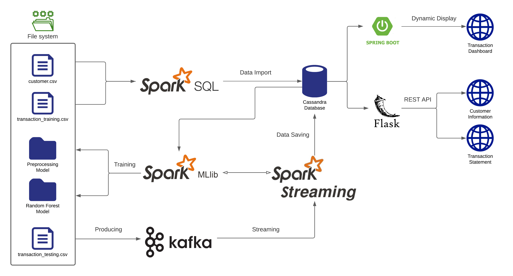
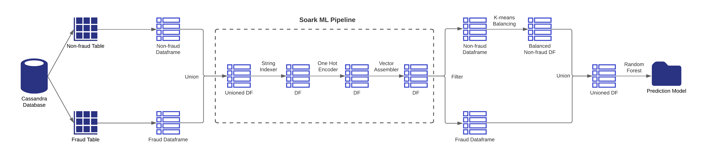
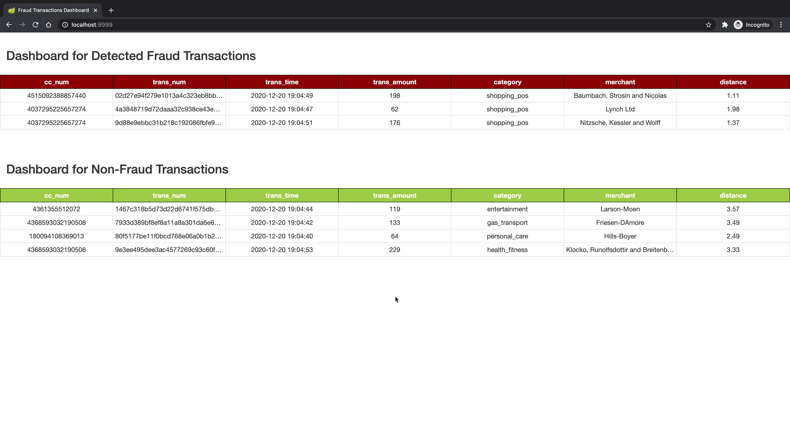
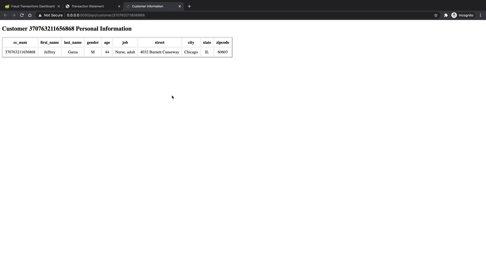
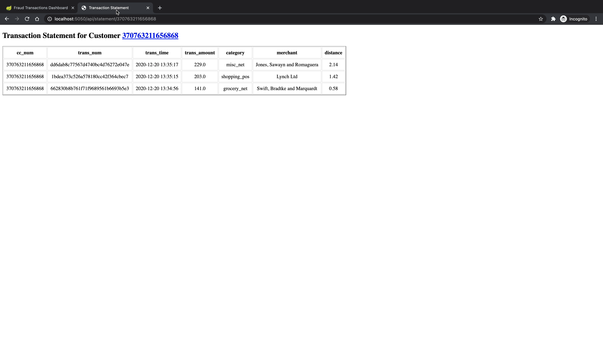

# Real-time Credit Card Fraud Detection Pipeline

## Workflow and Architecture
The following figure illustrates the workflow and architecture of the entire pipeline:


For the set-up part, I first simulate 100 customers' information and store it in the [customer.csv](./src/customer.txt) file, with over 10K transaction records stored in the transaction_training.csv file. Then, a Spark SQL job is called to retrieve those data and import them into a Cassandra database. Next, a Spark ML job runs to read the data from Cassandra, train on those data, and create the models (Preprocessing and Random Forest) to classify whether the transaction records are fraud or not.

After the models are saved to the file system, a Spark Streaming job starts that loads the ML models and consumes credit card transactions from Kafka. A Kafka topic is created to produce transaction records from the transaction_testing.csv file as messages that are consumed by the Spark Streaming job. The streaming job predicts whether these transactions are fraud or not and then saves them into the fraud_transaction and non_fraud_transaction tables separately based on the classification.

With the classified incoming transaction records stored in the Cassandra database, I use the Spring Boot framework to display the fraud and non-fraud transactions in real-time on the dashboard web page. Meanwhile, I also use the Flask framework to create two REST APIs that can easily retrieve customer information and create transaction statements for each customer.

A video demo for the workflow can be found here: https://youtu.be/fOVsxk16b0w

## Implementation Details

### Customers and Transactions dataset
Simulate 100 customers using Mockaroo. For each record, it includes the following columns:
- cc_num: credit card number which uniquely identifies each card / customer
- first: customer's first name
- last: customer's last name
- gender: customer's gender
- street
- city
- state
- zip: zip code for the address above
- lat: latitude for the address above
- long: longitude for the address above
- job: customer's vocation
- dob: the date of birth for the customer

Also generate over 10K transaction records for these customers using the same method. For each record, it includes the following columns:
- cc_num: credit card number which uniquely identifies each card / customer
- first: customer's first name
- last: customer's last name
- trans_num: transaction number
- trans_date: transaction date
- trans_time: transaction time
- unix_time: transaction time in unix timestamp format
- category: category for the purchased item
- amt: transaction amount
- merchant: the place where the transaction happened
- merch_lat: latitude for the merchant
- merch_long: longitude for the merchant
- is_fraud: boolean to indicate if the transaction is fraud or not

These transaction records are later used as the training set and testing set with a splitting ratio of 80%.

### Spark ML job
First, a Spark SQL job runs to retrieve the customers and transaction training data and import them into the Cassandra database. When importing the transactions data, the job also calculates two extra features, "age" and "distance", where "age" is the age of each customer by the time the data are imported according to their date of birth; "distance" is the distance between the customer's address and the merchant's address by calculating the Euclidean distance between two places using the latitude and longitude information. All the training data (including the two extra features) are split and stored in the fraud table and non-fraud table separately based on whether each record is fraud or not.

The Spark ML Job loads fraud and non-fraud transactions from their respective tables. This creates two different dataframes in Spark. Next, these two dataframes are combined using the Union function, and Spark ML Pipeline Stages are applied:
- First, a String Indexer is applied to transform the selected columns into double values, as the machine learning algorithm requires numerical input.
- Second, a One Hot Encoder is applied to normalize these double values.
- Third, a Vector Assembler is applied to assemble all the transformed columns into one feature column. The values of this column are vectors, which serve as input to the model creation algorithm.

After assembling the feature column, the algorithm is trained with this dataframe. To handle the class imbalance (where non-fraud transactions significantly outnumber fraud transactions), the job uses the K-means algorithm to reduce the number of non-fraud transactions, ensuring the dataset is balanced. Then, the Random Forest algorithm is applied to this balanced dataframe to create the prediction/classification model. Finally, the model is saved to the filesystem.

The following figure illustrates the entire Spark ML job workflow:


### Kafka producer
Create a Kafka topic named "creditcardTransaction" with 3 partitions.
```
kafka-topics --zookeeper localhost:2181 --create --topic creditcardTransaction --replication-factor 1 --partitions 3
```
The Kafka producer job randomly selects transactions from the transaction training dataset as messages and saves the current timestamp into the messages as the transaction time. Later, these messages are fed into the Spark Streaming job.

### Spark Streaming job
The Spark Streaming job starts by consuming credit card transaction messages from Kafka via the topic "creditcardTransaction". For each message, it reads customer data from Cassandra to compute the age of the customer and calculate the distance between the merchant and the customer's location. After that, it loads both the Preprocessing and Random Forest models created by the Spark ML job. These models are used to predict whether a transaction is fraud or not. Once predicted, the records are saved in the Cassandra database. Additionally, each message is assigned a partition number and an offset number, which are saved in the Kafka offset table to help achieve exactly-once semantics.

### Front-end dashboard
The front-end dashboard is designed with the Spring Boot framework to select fraud and non-fraud transactions from Cassandra tables and display them on the dashboard in real-time. This method calls a select query to retrieve the latest transactions that occurred in the last 5 seconds. To ensure records are only displayed once, the method maintains the maximum timestamp of previously displayed transactions and only selects those with a timestamp greater than the previous maximum.

The following screenshot illustrates the dashboard interface:


### REST API for customers and transaction statements
I also designed two REST APIs with the Flask framework to retrieve customer information and create transaction statements. These are implemented by calling SQL queries to select records from the Cassandra non-fraud table.
- For customer information, the endpoint is: /api/customer/<cc_num> which returns basic information for the credit card owner.
- For creating a transaction statement, the endpoint is: api/statement/<cc_num> which returns all transaction records for the credit card, ordered by transaction time.

The following screenshots illustrate examples of the two API calls:




## Maintainer
This project is maintained by Madhav Meesala, a Software Engineer with over 4 years of experience in building scalable full-stack and distributed systems. My background includes developing secure, high-performance solutions for financial services and digital payments using Java, Python, Spring Boot, and Kafka.

Contact Information:
- Name: Madhav Meesala
- Email: madhavmeesala@gmail.com
- Role: Software Engineer